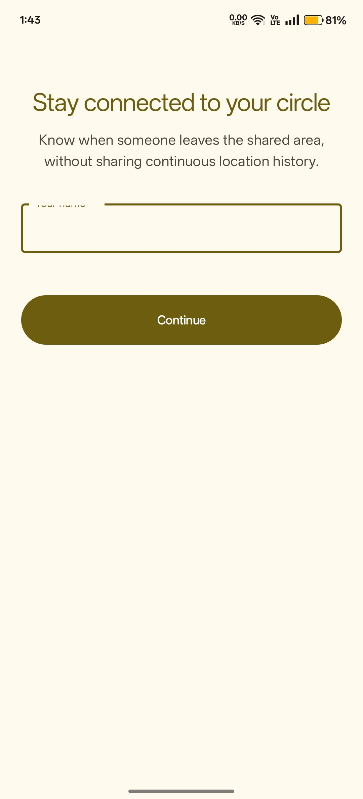
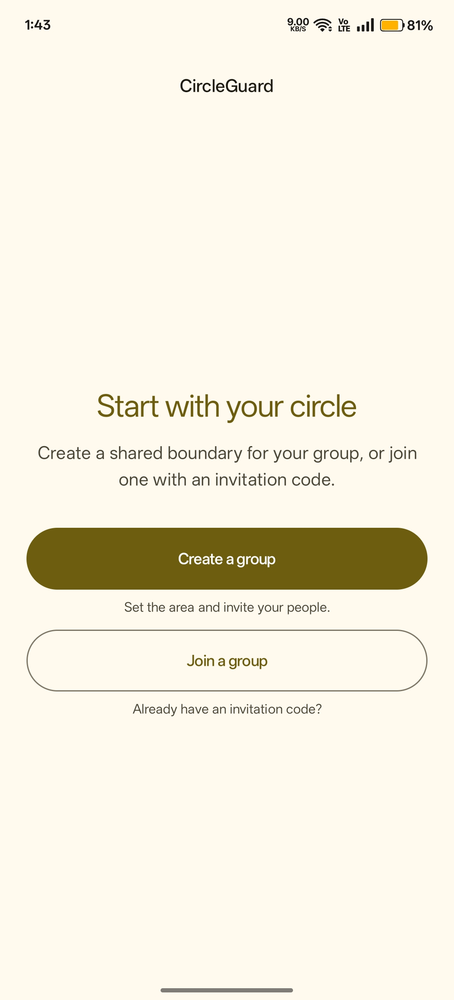
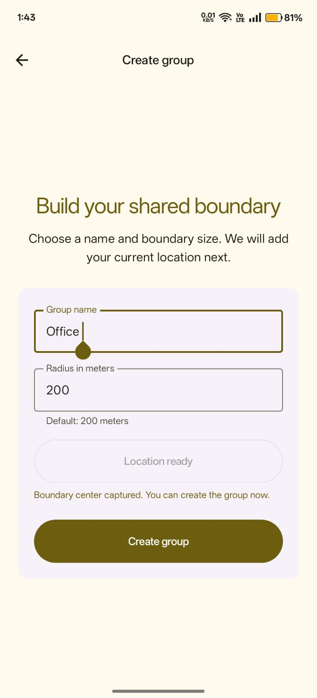
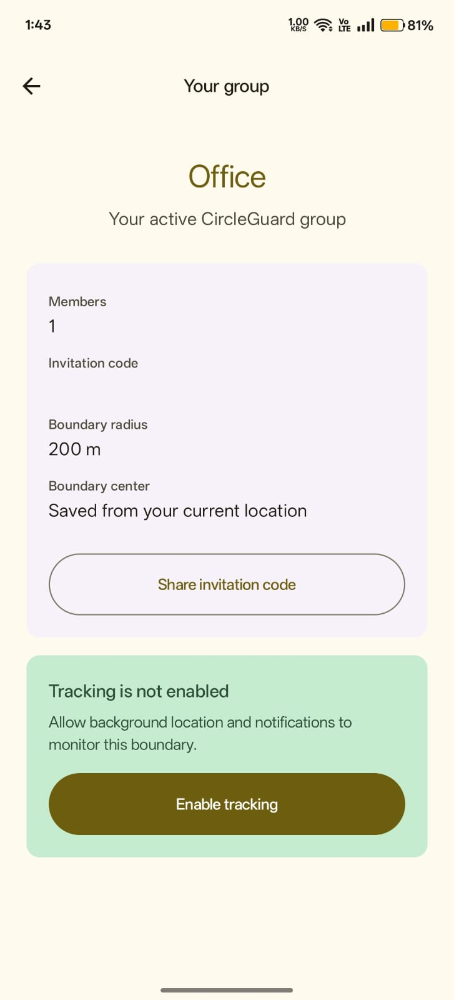

# CircleGuard

CircleGuard is a native Android app :

> A group of users creates a tracking group and geofence. When a member exits the geofenced region, the other members are notified.

## Scope

- Kotlin and Jetpack Compose with the supplied Material 3 theme
- Clean `presentation`, `domain`, and `data` layers
- Koin dependency injection
- Firebase Anonymous Authentication and Cloud Firestore
- Android circular geofencing and WorkManager retry handling
- Firebase Cloud Messaging notifications
- Cloudflare Worker notification backend
- One active tracking group per user for this assignment

## Screenshots

The main app flow is shown below in order:

### 1. Welcome

### 2. Home

### 3. Create a group

### 4. Active group and tracking

## Project setup

1. Open the project in Android Studio.
2. Ensure `app/google-services.json` belongs to the Firebase project configured for the app.
3. Enable Anonymous Authentication and Firestore.
4. Publish [`firestore.rules`](firestore.rules).
5. Configure the Worker secrets described in [`worker/README.md`](worker/README.md).
6. Build and install the debug APK on two Android devices with Google Play services.

The Firebase service-account JSON is never stored in this repository. Cloudflare Worker secrets are configured in Cloudflare and are not committed.

## Worker

The deployed notification Worker is:

`https://circleguard-notifications.akshay-circleguard.workers.dev`

The Worker source and deployment instructions are in [`worker/`](worker/).

## Test flow

1. Device A creates a group and shares the invitation code.
2. Device B joins the group.
3. Both devices grant precise foreground location, background location, notifications, and enable tracking.
4. Move one device outside the saved boundary.
5. The other member receives the exit notification and can open the group screen.

Android may delay background geofence transitions. Do not force-stop the app during testing.
